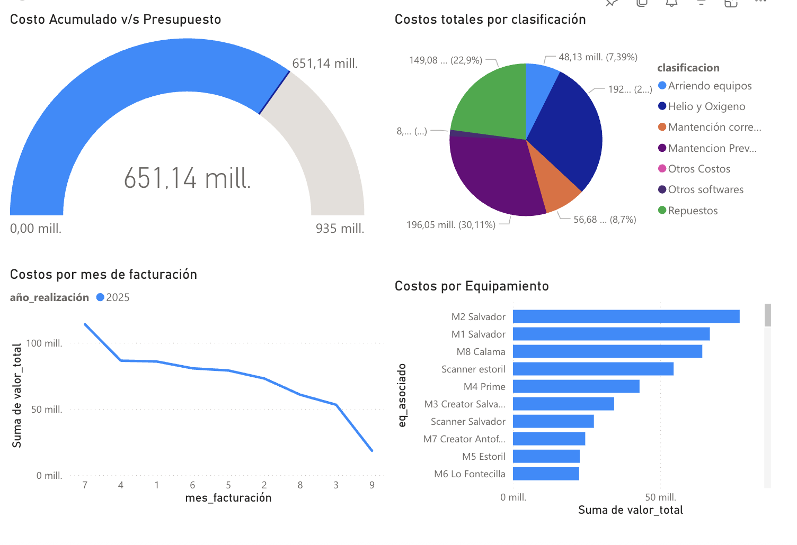

# Dashboard de Costos – Equipos Médicos

Este dashboard muestra el control de costos y presupuestos de equipos médicos de un centro médico.  
Incluye indicadores de:
- Gasto mensual vs presupuesto
- ROI de upgrades
- Distribución de costos preventivos/correctivos

