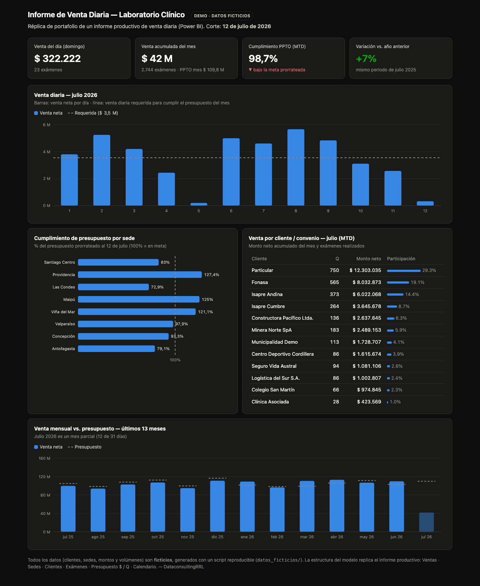
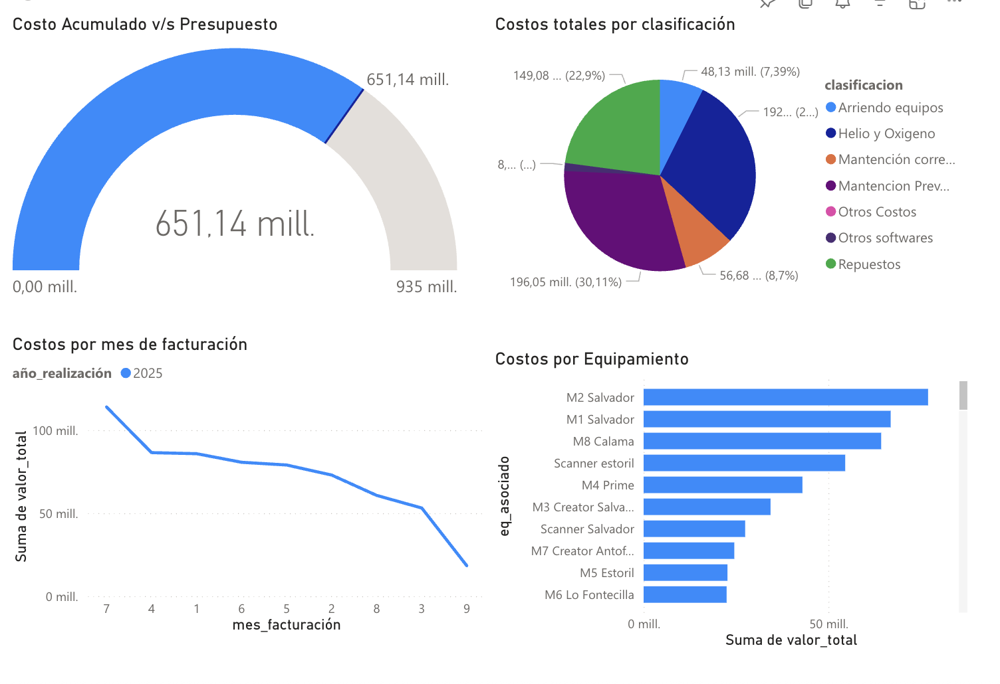

# Portafolio de Dashboards en Power BI

Proyectos de Business Intelligence desarrollados por **DataconsultingRRL**.
Los datos de los demos son ficticios o anonimizados.

## Proyectos

### 1. Informe de Venta Diaria — Laboratorio Clínico ([`informe-venta-diaria-demo/`](informe-venta-diaria-demo/))
Venta diaria multisede vs. presupuesto ($ y Q), cumplimiento por sede, convenios y
tendencia mensual. Incluye demo interactivo en HTML y dataset ficticio reproducible.

### 2. Dashboard de Costos — Equipos Médicos (`EQM.pbix`)
Control de costos y presupuestos de equipos médicos de un centro médico:
- Gasto mensual vs presupuesto
- ROI de upgrades
- Distribución de costos preventivos/correctivos

